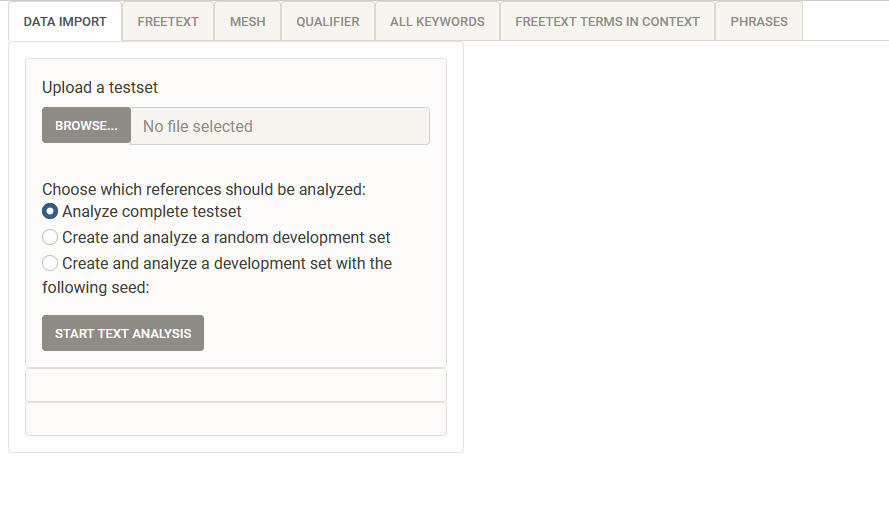

<!-- README.md is generated from README.Rmd. Please edit that file -->

```{r, include = FALSE}
knitr::opts_chunk$set(
  collapse = TRUE,
  comment = "#>",
  fig.path = "man/figures/README-",
  out.width = "100%"
)
```

# searchbuildR

<!-- badges: start -->

<!-- badges: end -->

The goal of searchbuildR is to identify overrepresented terms in a set of relevant references for a systematic review or evidence synthesis in general, which can then be applied in a boolean search in a bibliograpic database (e.g. PubMed). Detailed information are provided in the article [The searchbuildR shiny app: A new implementation of the objective approach for search strategy development in systematic reviews](https://doi.org/10.1002/cesm.12078)

## Installation

You can install searchbuildR from GitHub. The package is currently not released on CRAN, but will be in the future.

```{r remotes, eval = FALSE}
You may have to install the remotes package before installing an R package from github
install.packages("remotes")

```

```{r installation, eval = FALSE}
library(remotes)
remotes::install_github("https://github.com/IQWiG/searchbuildR")

```

## Example

After installing the package you can launch the Shiny App locally in R:

```{r example, eval = FALSE}
library(searchbuildR)
run_app()
```

The interface looks roughly like this (version 0.0.11):



## Development

For basic R functions, we used the tidyverse framework ([Wickham, 2022](https://CRAN.R-project.org/package=tidyverse)), a well-maintained and well-documented data science framework in R. For text mining and quantitative text analysis, we used the quanteda packages ([Benoit, 2018](https://doi.org/10.21105/joss.00774)). In addition, we used revtools ([Westgate, 2019a](https://doi.org/10.1002/jrsm.1374)) for handling bibliographic data and interactive data tables for R (“reactable” [Lin, 2023](https://CRAN.R-project.org/package=reactable)) for displaying user-friendly tables in the shiny app. The full list of R packages that need to be installed to run searchbuildR is included in the metadata of the package (see the code availability statement for more details). For the development process of the package, we followed the standards of Hadley Wickham (chief scientist at Posit PBC) ([Wickham, 2023](https://r-pkgs.org/, [Wickham, 2021](https://mastering-shiny.org/)), using the golem framework for production-grade shiny apps ([Fay, 2022](https://engineering-shiny.org/index.html)). We used git for version control, as suggested by Jennifer Bryan ([Bryan, 2023](https://happygitwithr.com/index.html)).\

## Questions, suggestions and bugs 

Ideas and suggestions for new functionalities or hints towards any bugs are welcome. Simply open an issue at <https://github.com/IQWiG/searchbuildR>.
